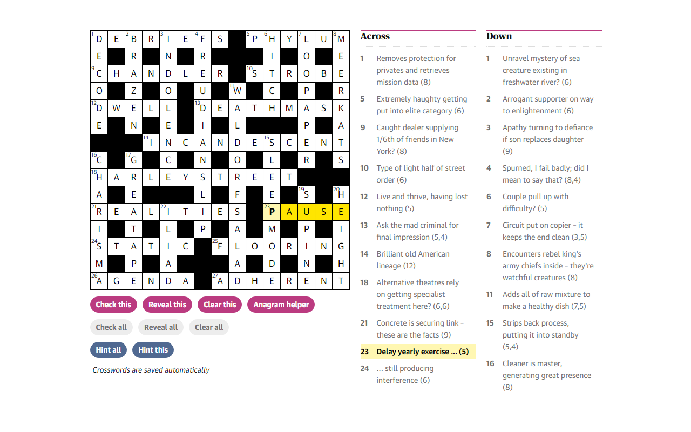

# Cryptic Crossword Hints

A Chrome extension to provide integrated hints for cryptic crosswords on the Guardian website. Currently works for the Guardian's Cryptic, Quiptic, and "Quick cryptic" puzzles.

Two new buttons are added which allow you to toggle definition underlining for all clues or the currently selected clue. Definitions are sourced from Fifteensquared.net and hence hints are only available if a solution for the puzzle has been published to the site.

Planned features:
- Add a new option which, when enabled, shows potential abbreviations when the cursor hovers above a word or phrase from the clue.
- Add a new option to modify the "check this" button so that it only checks if the entire word is correct (preventing "cheating" by accidently including one or more correct letters when guessing an entire word).

## Privacy Policy
This extension does not collect any user data.
